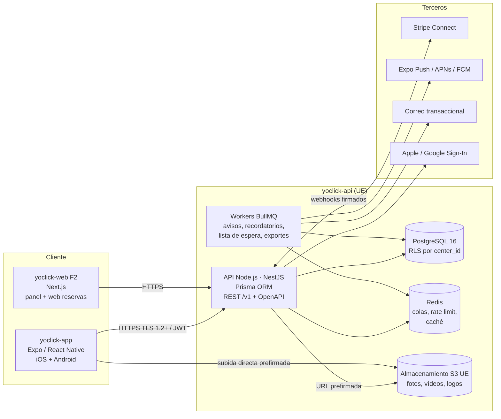

# 01 · Arquitectura

## Vista general



## Repositorios

Dos repos independientes, cada uno con su CI, versionado y despliegue. Se comunican **solo por el contrato OpenAPI**.

| Repo | Responsable de | Publica |
|---|---|---|
| `yoclick-api` | Dominio, persistencia, reglas de negocio, autorización, pagos, jobs | `openapi.yaml` (artefacto de CI en cada release, semver) |
| `yoclick-app` | UI móvil, navegación, estado del cliente, almacenamiento seguro local | Builds EAS (iOS/Android), OTA updates |

Flujo del contrato:

1. Un cambio de API empieza en `yoclick-api` (DTO + decorators → `openapi.yaml` generado y commiteado).
2. CI del backend falla si el `openapi.yaml` commiteado no coincide con el generado, y ejecuta `oasdiff` para detectar *breaking changes* (requieren `/v2` o un periodo de compatibilidad).
3. `yoclick-app` copia el contrato a `docs/api/openapi.yaml` y ejecuta `pnpm api:gen` (Orval) → cliente TypeScript + hooks TanStack Query + mocks MSW + esquemas zod.

## Backend (`yoclick-api`)

| Pieza | Elección | Por qué |
|---|---|---|
| Runtime | Node.js 22 LTS | LTS, mismo lenguaje que la app |
| Framework | NestJS 11 sobre Node.js (adaptador Fastify) | Módulos, DI, guards, pipes; encaja con arquitectura por capas |
| Lenguaje | TypeScript `strict` | — |
| BD | PostgreSQL 16 o superior | RLS nativa, `EXCLUDE` para solapes de citas, JSONB |
| ORM / migraciones | **Prisma ORM** (última estable) con driver adapter `@prisma/adapter-pg` + Prisma Migrate | Esquema declarativo, cliente tipado, migraciones versionadas. Lo que Prisma no modela (RLS, `EXCLUDE`, extensiones) va en SQL dentro de las migraciones. Ver «Prisma y RLS». |
| Validación | zod (DTOs) + `nestjs-zod` → OpenAPI | Una sola fuente para validar y documentar |
| Colas | Redis 7 + BullMQ | Recordatorios, avisos, lista de espera, exportes |
| Auth | Tokens propios: access JWT (EdDSA, 10 min) + refresh opaco rotativo (30 días) | Control total, revocación |
| Pagos | Stripe Connect (cuentas Express por centro) + Stripe Billing para la suscripción a Yoclick | El dinero del cliente va al centro; Yoclick no custodia fondos |
| Ficheros | S3 compatible en UE (p. ej. Cloudflare R2 jurisdicción UE, Scaleway, OVH) | RGPD |
| Observabilidad | pino (logs JSON sin PII), OpenTelemetry, Sentry | — |
| Tests | Vitest + Supertest + Testcontainers (Postgres real) | RLS solo se prueba con Postgres real |

Estructura por módulo (arquitectura hexagonal ligera):

```
src/
  modules/
    bookings/
      domain/        entidades, value objects, reglas puras (sin Nest, sin BD)
      application/   casos de uso (BookSlotUseCase…), puertos (interfaces)
      infrastructure/ repositorios Prisma, adaptadores Stripe…
      http/          controller, DTOs zod, mappers
      bookings.module.ts
  shared/            auth, tenancy, errors, pagination, idempotency, audit
  shared/database/   PrismaService, extensión de tenant (RLS), helpers de transacción
prisma/
  schema.prisma      modelos (o carpeta prisma/schema/*.prisma por módulo)
  migrations/        migraciones generadas + SQL añadido (RLS, EXCLUDE, índices parciales)
  sql/               consultas TypedSQL (SELECT … FOR UPDATE, disponibilidad)
  seed.ts
  jobs/              workers BullMQ
```

## App (`yoclick-app`)

| Pieza | Elección |
|---|---|
| Framework | Expo SDK estable más reciente (≥ 54), New Architecture, Hermes |
| Navegación | Expo Router (rutas tipadas) |
| Lenguaje | TypeScript `strict` + `noUncheckedIndexedAccess` |
| Estado servidor | TanStack Query v5 (cliente generado por Orval) |
| Estado cliente | Zustand (solo UI y sesión; nada de datos de servidor) |
| Formularios | react-hook-form + zod |
| Tokens de sesión | `expo-secure-store` (Keychain / Keystore) |
| i18n | i18next + `expo-localization` (es-ES por defecto) |
| UI | Componentes propios (Atomic Design) sobre tokens; `react-native-reanimated`, `@shopify/flash-list`, `expo-image`, `react-native-svg`, Lucide |
| Cámara / QR | `expo-camera` (escáner integrado) |
| Push | `expo-notifications` |
| Pagos | `@stripe/stripe-react-native` (PaymentSheet) |
| Tests | Jest + React Native Testing Library, MSW, Maestro (E2E), Storybook RN |
| Calidad | ESLint (flat config) + Prettier + `tsc --noEmit` + Knip |
| Builds | EAS Build / Submit / Update; *app variants* por centro para Premium |

## Multi-tenant

- **Una base de datos, un esquema.** Toda tabla de negocio tiene `center_id uuid not null`.
- Cada petición autenticada trabaja dentro de una transacción de Prisma que primero ejecuta `select set_config('app.center_id', $1, true)` (y `app.user_id`, `app.membership_id`, `app.role`). El `true` hace el valor local a la transacción, así que es seguro con *pool* de conexiones y PgBouncer en modo transacción. Las políticas RLS filtran por `current_setting('app.center_id')`.
- El rol de BD de la API **no es dueño de las tablas** y no tiene `BYPASSRLS`. Las migraciones usan otro rol.
- El `center_id` de la petición sale de la cabecera `X-Center-Id` **y se verifica** contra las membresías del usuario (guard `TenantGuard`). Nunca se confía en un `center_id` del cuerpo.
- El superadmin usa un rol distinto con acceso auditado (cada lectura queda en `audit_log`).

## Prisma y RLS

Prisma no gestiona RLS por sí mismo; se combina así:

1. **Dos URLs de conexión.** `DATABASE_URL` usa el rol `yoclick_app` (sin `BYPASSRLS`, no dueño de las tablas). `DIRECT_DATABASE_URL` / `MIGRATION_DATABASE_URL` usa el rol `yoclick_migrator`, solo en CI/CD para `prisma migrate deploy`.
2. **Políticas en migraciones.** `prisma migrate dev --create-only`, y se añade al `migration.sql` el `enable/force row level security`, las políticas, `create extension btree_gist` y las restricciones `EXCLUDE`. Prisma conserva ese SQL.
3. **Contexto por petición.** `TenantPrismaService.runInTenantContext(actorContext, async (transactionClient) => …)` abre `prisma.$transaction`, ejecuta `set_config(..., true)` con `$executeRaw` parametrizado y entrega el `transactionClient` a los repositorios. Ningún repositorio usa el `PrismaClient` global para datos de un centro (regla de lint + test).
4. **Consultas que Prisma no expresa** (`SELECT … FOR UPDATE`, cálculo de huecos con `generate_series`, búsqueda geográfica) con **TypedSQL** (`prisma/sql/*.sql`) o `$queryRaw` con *tagged template*. `$queryRawUnsafe` y `$executeRawUnsafe` están prohibidos.
5. **Tipos de dominio, no de Prisma.** Los repositorios mapean modelos Prisma a entidades de dominio; `@prisma/client` solo se importa en `infrastructure/`.

## Marca blanca en la app

- **Compartida (Básico/Pro):** al unirse, la app descarga `GET /v1/centers/{id}/branding` (nombre, logo, color, tipo de centro, vocabulario). `brand-engine` calcula `on-brand`, `brand-ink`, `brand-soft` para claro y oscuro y el `ThemeProvider` los inyecta. Se cachea por centro.
- **Premium:** `app.config.ts` lee `APP_VARIANT` / `CENTER_SLUG` y fija `name`, `slug`, `ios.bundleIdentifier`, `android.package`, `icon`, `splash`, `scheme`, y `extra.lockedCenterId`. Un perfil EAS por centro. El código es el mismo.

## Entornos

| Entorno | API | App | Datos |
|---|---|---|---|
| `local` | Docker Compose (Postgres, Redis, MinIO, Stripe CLI, Mailpit) | Expo Go / dev client | Seed demo |
| `staging` | Contenedor en UE | Canal EAS `preview` | Seed demo + anonimizados |
| `production` | Contenedor en UE, réplicas ≥ 2, BD gestionada con PITR | Canal `production` | Reales |

Hosting sugerido (UE): API en Fly.io región `mad`/`cdg`, Render Frankfurt, Scaleway o AWS `eu-south-2`; Postgres gestionado con copias cifradas y PITR 7 días.

## Requisitos no funcionales

- p95 de la API < 300 ms en lecturas, < 600 ms en reservas.
- Disponibilidad objetivo 99,5 % (MVP).
- La app arranca en frío < 2,5 s en un Android de gama media.
- Reserva sin solapes garantizada por BD (restricción `EXCLUDE`), no solo por código.
- Funciona con conexión lenta: reintentos, estados optimistas solo donde es seguro (no en pagos).
- Accesibilidad WCAG 2.2 AA, Dynamic Type / escalado de fuente hasta 200 %, lectores de pantalla.
