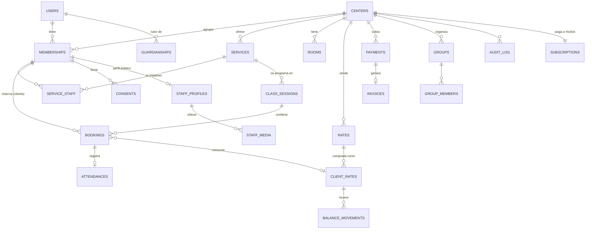

# 02 · Modelo de datos

Convenciones: modelos Prisma en inglés y singular `PascalCase` (`ClassSession`), mapeados a tablas en plural `snake_case` con `@@map("class_sessions")` y columnas con `@map("center_id")`; campos en el código en `camelCase` descriptivo (`startsAt`, `remainingSessionCount`); PK `id uuid` (UUIDv7, generado en la API); `created_at`, `updated_at timestamptz`; borrado lógico solo donde se indica (`deleted_at`); importes en **céntimos** (`integer`) + `currency char(3)` = `'EUR'`; horas en `timestamptz` (UTC) y la zona horaria del centro en `centers.timezone`.

## Diagrama



## Entidades

### Identidad y pertenencia

| Tabla | Campos clave | Notas |
|---|---|---|
| `users` | `id, email (citext, unique), email_verified_at, password_hash (argon2id), full_name, phone, birth_date, avatar_key, locale, deleted_at` | **Global** (sin `center_id`): una persona, varios centros. Sin RLS por centro; acceso solo a sí mismo. |
| `auth_identities` | `user_id, provider ('apple'\|'google'), provider_subject, unique(provider, provider_subject)` | Sign in with Apple / Google |
| `refresh_tokens` | `id, user_id, family_id, token_hash, device_id, expires_at, revoked_at, replaced_by` | Rotación con detección de reutilización (si un token revocado se usa → revocar toda la familia) |
| `mfa_factors` | `user_id, type ('totp'), secret_enc, confirmed_at` | Obligatorio para `owner` y `admin` |
| `centers` | `id, slug, name, sector_id, brand_color, logo_key, timezone, join_code (unique, 6), address, geo (point), opening_hours jsonb, holidays jsonb, cancel_policy jsonb, status ('trial'\|'active'\|'past_due'\|'suspended'), plan_id, stripe_account_id, trial_ends_at` | Tenant raíz |
| `memberships` | `id, center_id, user_id, role ('owner'\|'admin'\|'staff'\|'client'), status ('invited'\|'active'\|'blocked'\|'left'), level, goals text[], staff_title, permissions jsonb, joined_at` | `unique(center_id, user_id)`; un usuario puede ser staff en un centro y cliente en otro |
| `guardianships` | `guardian_user_id, minor_user_id, center_id, consent_id, verified_at` | Menores < 14 años: consentimiento del tutor (LOPDGDD art. 7) |
| `invitations` | `id, center_id, kind ('client'\|'staff'), email, token_hash, role, expires_at, accepted_at` | Enlaces de invitación de un solo uso |
| `sector_templates` | `id, name, family, vocabulary jsonb, levels text[], needs text[], goals text[], suggested_services jsonb, suggested_groups jsonb` | Global, solo lectura para centros; seed desde el prototipo |

### Agenda y reservas

| Tabla | Campos clave | Notas |
|---|---|---|
| `services` | `id, center_id, name, description, kind ('individual'\|'group'), duration_min, capacity, price_cents (nullable), color, room_id, booking_window_days, min_notice_min, cancel_notice_min, visible, sort_order, valid_from, valid_to, archived_at` | Editor completo del prototipo (`asvc`) |
| `service_staff` | `service_id, membership_id` | Quién puede impartirlo |
| `rooms` | `id, center_id, name, capacity` | Aviso de conflicto de sala |
| `staff_availability` | `id, center_id, membership_id, weekday, start_time, end_time, valid_from, valid_to` | Disponibilidad semanal |
| `staff_absences` | `id, center_id, membership_id, starts_at, ends_at, reason` | Vacaciones / bajas (sin motivo médico detallado) |
| `class_sessions` | `id, center_id, service_id, staff_membership_id, room_id, starts_at, ends_at, capacity, status ('scheduled'\|'cancelled'), recurrence_id` | Una ocurrencia. Para servicios individuales se crea al reservar. |
| `bookings` | `id, center_id, class_session_id, client_membership_id, booked_for_user_id, status ('confirmed'\|'waitlisted'\|'cancelled'\|'no_show'\|'attended'), waitlist_position, client_rate_id, payment_id, cancelled_at, cancelled_by, cancel_within_policy bool, idempotency_key` | `booked_for_user_id` ≠ cliente cuando reserva un tutor |
| `attendances` | `booking_id, center_id, checked_in_at, method ('qr'\|'manual'), checked_by_membership_id` | — |
| `checkin_tokens` | *(no se guarda)* | El QR es un token firmado de vida corta (ver seguridad) |

Restricciones de integridad:

```sql
-- Un instructor no puede tener dos sesiones solapadas
alter table class_sessions add constraint no_staff_overlap
  exclude using gist (staff_membership_id with =, tstzrange(starts_at, ends_at) with &&)
  where (status = 'scheduled');

-- Una sala tampoco
alter table class_sessions add constraint no_room_overlap
  exclude using gist (room_id with =, tstzrange(starts_at, ends_at) with &&)
  where (status = 'scheduled' and room_id is not null);

-- Un cliente no reserva dos veces la misma sesión
create unique index bookings_once on bookings (class_session_id, booked_for_user_id)
  where status in ('confirmed','waitlisted');
```

Las plazas se controlan con `select … for update` sobre la sesión dentro de la transacción de reserva (o un contador con `check (booked <= capacity)`).

### Cobros

| Tabla | Campos clave | Notas |
|---|---|---|
| `rates` | `id, center_id, name, kind ('pack'\|'subscription'\|'enrollment'\|'single'), sessions_count, valid_days, price_cents, vat_rate, service_ids uuid[], stripe_price_id, active` | Bonos, cuotas, matrícula |
| `client_rates` | `id, center_id, client_membership_id, rate_id, remaining_sessions, starts_at, expires_at, status, stripe_subscription_id` | Lo que el cliente ha comprado |
| `balance_movements` | `id, center_id, client_rate_id, booking_id, delta, reason` | Libro mayor inmutable (solo inserts) |
| `wallets` / `wallet_movements` | `client_membership_id, balance_cents` / `delta_cents, reason, payment_id` | Monedero |
| `coupons` | `id, center_id, code, percent_off, amount_off_cents, max_redemptions, expires_at` | — |
| `payments` | `id, center_id, client_membership_id, amount_cents, currency, status, stripe_payment_intent_id (unique), method, refunded_cents` | La verdad la marca el **webhook**, no la app |
| `invoices` | `id, center_id, payment_id, series, number, issued_at, net_cents, vat_cents, total_cents, pdf_key, verifactu_status` | Numeración correlativa por serie y centro; VeriFactu en F2 |
| `stripe_events` | `id (evt_…), type, processed_at` | Idempotencia de webhooks |

### Personas y contenido

| Tabla | Campos clave | Notas |
|---|---|---|
| `client_notes` | `id, center_id, client_membership_id, author_membership_id, body, visibility ('staff'\|'admins')` | Notas del equipo |
| `health_records` | `id, center_id, client_membership_id, data_enc bytea, consent_id, updated_by` | **Categoría especial (RGPD art. 9)**: cifrado a nivel de campo, acceso solo con permiso `health:read`, cada lectura auditada |
| `consents` | `id, center_id, user_id, kind ('privacy'\|'terms'\|'marketing'\|'health'\|'image'\|'parental'), version, granted bool, granted_at, revoked_at, ip_hash, user_agent` | Inmutable; una fila por cambio |
| `groups` / `group_members` | `id, center_id, name, level, schedule_note` | — |
| `staff_profiles` | `membership_id, center_id, bio, specialties text[], certifications jsonb, intro_video_id, status ('draft'\|'pending'\|'published'\|'rejected'), reviewed_by, reviewed_at` | Publicado solo tras revisión del centro |
| `staff_media` | `id, center_id, membership_id, kind ('intro'\|'skill'), title, storage_key, mime, duration_s, size_bytes, status ('uploading'\|'processing'\|'ready'\|'rejected')` | Vídeo validado y transcodificado por un worker |
| `reviews` | `id, center_id, staff_membership_id, booking_id (unique), rating 1–5, body, status` | Solo de citas con asistencia («opiniones verificadas») |
| `notifications` | `id, center_id, user_id, type, payload jsonb, read_at` | Bandeja de avisos |
| `push_tokens` | `id, user_id, expo_token, platform, device_id, last_seen_at` | — |
| `notification_prefs` | `user_id, center_id, channel, type, enabled` | — |

### Plataforma

| Tabla | Notas |
|---|---|
| `plans` | `id, name, monthly_cents, yearly_cents, client_limit, features jsonb, stripe_price_ids` |
| `subscriptions` | `center_id, plan_id, status, stripe_subscription_id, current_period_end, cancel_at` |
| `audit_log` | `id, center_id (nullable), actor_user_id, actor_role, action, entity, entity_id, ip_hash, at, meta jsonb` — solo inserts, retención 2 años |
| `support_access` | `id, center_id, superadmin_user_id, reason, started_at, ended_at` — «Entrar como soporte (solo lectura, queda registrado)» |

## Esquema Prisma (extracto de referencia)

```prisma
generator client {
  provider = "prisma-client"
  output   = "../src/generated/prisma"
}

datasource db {
  provider = "postgresql"   // la URL va en prisma.config.ts (Prisma 7) o en url = env("DATABASE_URL")
}

enum MembershipRole   { owner admin staff client }
enum BookingStatus    { confirmed waitlisted cancelled no_show attended }
enum CenterStatus     { trial active past_due suspended }
enum MembershipStatus { invited active blocked left }

model Center {
  id           String       @id @db.Uuid
  slug         String       @unique
  name         String
  sectorId     String       @map("sector_id")
  brandColor   String       @map("brand_color") @db.Char(7)
  timezone     String       @default("Europe/Madrid")
  joinCode     String       @unique @map("join_code") @db.Char(6)
  status       CenterStatus @default(trial)
  memberships  Membership[]
  services     Service[]
  createdAt    DateTime     @default(now()) @map("created_at") @db.Timestamptz
  updatedAt    DateTime     @updatedAt @map("updated_at") @db.Timestamptz
  @@map("centers")
}

model Membership {
  id        String           @id @db.Uuid
  centerId  String           @map("center_id") @db.Uuid
  userId    String           @map("user_id") @db.Uuid
  role      MembershipRole
  status    MembershipStatus @default(active)
  center    Center           @relation(fields: [centerId], references: [id])
  user      User             @relation(fields: [userId], references: [id])
  bookings  Booking[]        @relation("ClientBookings")
  @@unique([centerId, userId])
  @@index([centerId, role])
  @@map("memberships")
}

model Booking {
  id                   String        @id @db.Uuid
  centerId             String        @map("center_id") @db.Uuid
  classSessionId       String        @map("class_session_id") @db.Uuid
  clientMembershipId   String        @map("client_membership_id") @db.Uuid
  bookedForUserId      String        @map("booked_for_user_id") @db.Uuid
  status               BookingStatus
  waitlistPosition     Int?          @map("waitlist_position")
  idempotencyKey       String        @map("idempotency_key") @db.Uuid
  cancelledAt          DateTime?     @map("cancelled_at") @db.Timestamptz
  classSession         ClassSession  @relation(fields: [classSessionId], references: [id])
  clientMembership     Membership    @relation("ClientBookings", fields: [clientMembershipId], references: [id])
  @@index([centerId, classSessionId])
  @@index([centerId, clientMembershipId, status])
  @@map("bookings")
}
```

- Ids UUIDv7 generados en la aplicación (`uuidv7()`), no `@default(uuid())`, para orden temporal.
- Dinero: `Int` en céntimos (`priceCents`), nunca `Float` ni `Decimal` para importes de cliente.
- Las restricciones `EXCLUDE`, los índices parciales y las políticas RLS de abajo **no caben en `schema.prisma`**: se añaden a mano en el `migration.sql` correspondiente (`prisma migrate dev --create-only`).

## RLS (patrón)

```sql
alter table bookings enable row level security;
alter table bookings force row level security;

create policy tenant_isolation on bookings
  using (center_id = current_setting('app.center_id', true)::uuid)
  with check (center_id = current_setting('app.center_id', true)::uuid);

-- Los clientes solo ven sus reservas (o las de sus menores); el staff ve todas las del centro
create policy client_own on bookings as restrictive
  using (
    current_setting('app.role', true) in ('owner','admin','staff')
    or client_membership_id = current_setting('app.membership_id', true)::uuid
    or booked_for_user_id in (
      select minor_user_id from guardianships
      where guardian_user_id = current_setting('app.user_id', true)::uuid)
  );
```

- `force row level security` en todas las tablas con `center_id`.
- La autorización fina (BOLA, BFLA) se hace **también** en la capa de aplicación (guards y casos de uso); RLS es la red de seguridad.
- Test obligatorio por tabla: con `app.center_id = A`, ninguna consulta devuelve filas de B.

## Retención y borrado

| Dato | Retención |
|---|---|
| Cuenta eliminada por el usuario | Anonimizar `users` (email → hash, nombre → «Usuario eliminado») en ≤ 30 días; borrar avatar y salud de inmediato |
| Facturas y pagos | 6 años (Código de Comercio art. 30) — se conservan desvinculados del perfil |
| Salud | Mientras dure la relación + revocación inmediata al retirar el consentimiento |
| Logs técnicos | 30 días, sin PII |
| `audit_log` | 2 años |
